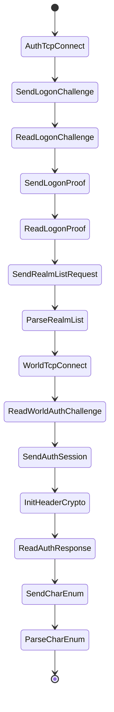

# Minimal Client State Diagram

Status: Stage 11 start draft

## State Notes

- `AuthTcpConnect`: connect to local authserver on `127.0.0.1:3724`.
- `SendLogonChallenge`: send `AUTH_LOGON_CHALLENGE` with build `12340`.
- `ReadLogonChallenge`: parse SRP6 `B`, `g`, `N`, salt, version challenge, and security flags.
- `SendLogonProof`: send SRP6 `A`, client proof, version proof, and security flags.
- `ReadLogonProof`: validate server proof and retain the 40-byte session key in memory only.
- `SendRealmListRequest`: send command `0x10` plus four reserved zero bytes.
- `ParseRealmList`: extract host, port, and realm id from the first compatible realm.
- `WorldTcpConnect`: connect to the parsed worldserver endpoint.
- `ReadWorldAuthChallenge`: parse `SMSG_AUTH_CHALLENGE` and server seed.
- `SendAuthSession`: send `CMSG_AUTH_SESSION` with the account digest.
- `InitHeaderCrypto`: initialize ARC4-drop1024 header crypto after auth session is accepted by the server path.
- `ReadAuthResponse`: parse `SMSG_AUTH_RESPONSE`.
- `SendCharEnum`: send empty `CMSG_CHAR_ENUM`.
- `ParseCharEnum`: parse `SMSG_CHAR_ENUM` into safe local character summaries.
